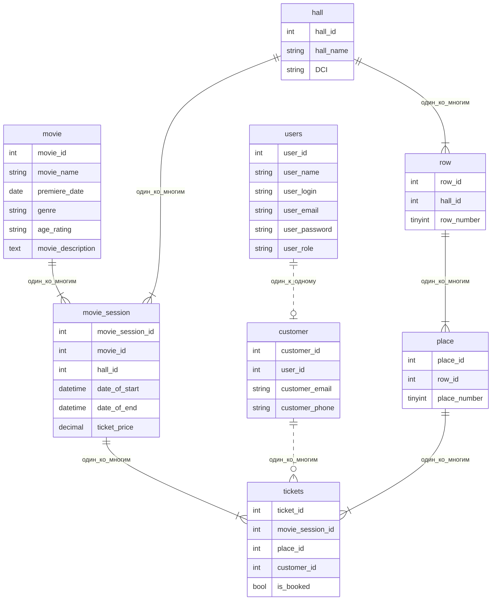

# php_professional_hw
For otus php professional course homeworks

# Логическая схема данных

```mermaid
erDiagram
    
    hall ||--|{ row: один_ко_многим
    row || --|{ place: один_ко_многим
    hall {
        int hall_id
        string hall_name
        string DCI
    }
    row {
        int row_id
        int hall_id
        tinyint row_number
    }
    place {
        int place_id
        int row_id
        tinyint place_number
    }
    movie{
        int movie_id
        string movie_name
        date premiere_date
        string genre
        string age_rating
        text movie_description    
    }
    movie_session{
        int movie_session_id
        int movie_id
        int hall_id
        datetime date_of_start
        datetime date_of_end
        decimal ticket_price
    }
    movie ||-- |{ movie_session: один_ко_многим
    hall || -- |{ movie_session: один_ко_многим
    customer{
        int customer_id
        int user_id
        string customer_email
        string customer_phone
    }
    tickets{
        int ticket_id
        int movie_session_id
        int place_id
        int customer_id
        bool is_booked
    }
    users {
        int user_id
        string user_name
        string user_login
        string user_email
        string user_password
        string user_role
    }
    movie_session ||--|{ tickets: один_ко_многим
    customer || .. o{ tickets: один_ко_многим
    place || -- |{ tickets: один_ко_многим
    users || .. o| customer: один_к_одному
```